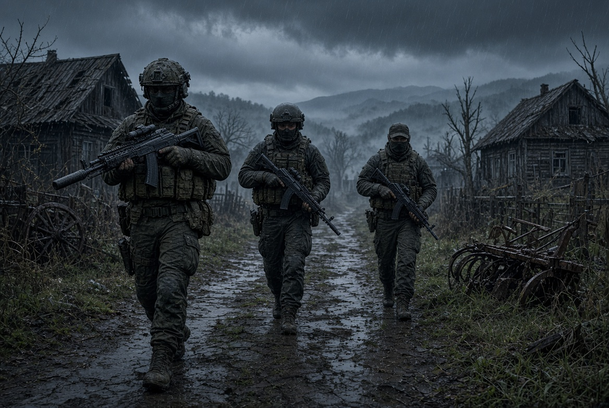

# 🌍 SNW: Live Anyway — Concept Document

[](https://creativecommons.org/licenses/by-nc-nd/4.0/)
[]()
[]()

<p align="center">
  
</p>
> **"I am the one who builds the new world."**
> A radical, hardcore sandbox in the post-apocalyptic survival-simulator genre, built on the principles of **Simulation-Native Worlds (SNW)**. Here the digital environment exists on its own terms, and history is born from the emergent actions of players — free of game-design crutches and linear scripts.

---

## 📑 Contents
* [🎯 Core Idea and Philosophy](#-core-idea-and-philosophy)
* [🗺️ The Infinite Hex-Cell Map](#️-the-infinite-hex-cell-map)
* [🛡️ Differentiation of the Safety Rings](#️-differentiation-of-the-safety-rings)
* [💀 Progression, Death, and Insurance](#-progression-death-and-insurance)
* [⚖️ Might vs. Magic (Politics and Law)](#️-might-vs-magic-politics-and-law)
* [🏭 Economy, Crafting, and Logistics](#-economy-crafting-and-logistics)
* [🚀 The Evolutionary Vector of the Civilization Fractal](#-the-evolutionary-vector-of-the-civilization-fractal)

---

## 🎯 Core Idea and Philosophy

In today's industry, the notion of freedom has been replaced by a choice among pre-programmed rails. **SNW: Live Anyway** does away with that crutch:

* **The world as a system, not a script:** There are no story triggers. There are only the basic physical properties of matter and emergent cause-and-effect relationships.
* **Anti-toxic architecture:** After a player is killed, **their corpse cannot physically be looted**. This completely eliminates senseless violence for loot. PvP survives only in service of larger goals: ideology, geopolitics, revenge, and control of strategic zones.
* **Life without an observer:** When you log off, the simulation of air, materials, NPCs, and the economy continues uninterrupted.

---

## 🗺️ The Infinite Hex-Cell Map

The global world is organized on the principle of **dynamic fractal expansion**:
1. Each hexagonal cell (a **District**) is an **isolated compute server**. It loads only when players cross its border.
2. **Server limits prevent overcrowding:** capacity is split between a **20% Resident Quota** (permanent, instant entry for citizens) and an **80% Visitor Slot** (entry for transient guests via a virtual queue).
3. **Honest distance weight:** to travel from District No. 1 to District No. 3, you must cross the dangerous District No. 2 on foot or by vehicle, from edge to edge. Long-distance expeditions become deadly campaigns.

---

## 🛡️ Differentiation of the Safety Rings

Each District's space is radially divided into 4 zones, each with its own rules:

| Ring | Name | Level and Nature of Protection | Interface Rules |
| :--- | :--- | :--- | :--- |
| **Ring 1** | **Citadel (City)** | **Absolute safety**. A zone under the total control of the AI-Mayor (in the Zero District) or the Community. | Weapons are blocked at the code level. Crimes are impossible. |
| **Ring 2** | **Suburb / Industrial Zone** | **Conditional safety**. Guarded by heavy automated turrets. Zombies occasionally break through. | Weapons are permitted. Deliberately wounding or killing a player results in instant annihilation by the turrets. |
| **Ring 3** | **Gray Zone** | **Partial protection**. The AI-Mayor does not physically control the ground but maintains satellite surveillance. | Any attack imposes a permanent **Persona Non Grata** status (shot on sight by turrets when approaching Rings 1 and 2). |
| **Ring 4** | **Wild Territory** | **Absolute chaos** (80–90% of the District's area). A land of total lawlessness, mutants, and valuable loot. | Only the law of the strong applies — firepower and tactical instinct. |

---

## 💀 Progression, Death, and Insurance

* **It's the person who levels up, not the character:** There are no artificial levels, classes, or passive-skill trees. Only the public record of your actions matters.
* **Physical crafting:** Assembling advanced gear isn't a menu click. It's a process that demands attention and manual dexterity from the player at the keyboard. A mistake or a shaky hand causes a **defect factor** and the loss of materials.
* **Permanent death:** The cost of a mistake is maximal. Upon death, the character is deleted forever. The only safeguard is **Medical Evacuation (Insurance)**:
  * If an active **Medical Card for that District** is in your PDA, losing consciousness triggers a drone that carries your character to a Medical Center bed, with the loot fully preserved.
  * In the Zero District, the Medical Card is purchased with standard currency. In Private Districts, the Community must supply the Medical Center's reactor with rare, single-use **medical-nuclear batteries**, or the drones physically cannot take off.
  * Using Zero District insurance within a Private District is technically forbidden.

---
## Valhalla:

A new location — a museum.
Where the ghosts of fallen legendary players will rest.
---
## ⚖️ Might vs. Magic (Politics and Law)

In **Private Districts** created by Communities (clans), the AI-Mayor holds no power. The head of the Community is recognized as the **District Owner**, with total legislative authority exercised through decrees in the PDA.

> **The triumph of emergence:** the system never converts a ruler's laws into magical, system-enforced bans.

If the Leader bans outside bases, the game code does *not* disable crafting. Any guerrilla group can secretly slip deep into the Wildlands of someone else's cell and build an illegal Settlement there. If the Community is strong and its patrols with **frequency antennas** control the territory, it will find and blow up the violators by force. If the Community is weak, its bans in the PDA are worth nothing, and black markets will flourish on the fringes.

---

## 🏭 Economy, Crafting, and Logistics

Resources in the world (ores, uranium, wood) are not limited in quantity, but are strictly limited in accessibility — extraction requires physical effort, time, and the building of production chains (Ore ➔ Ingot ➔ Gun Barrel ➔ Rifle).

### Four Crafting Tiers:
1. **Manual crafting:** From the PDA, anywhere in the world (only primitive torches, bandages).
2. **Workbench:** Starting tools and low-tier weapons. Requires maximum concentration and time.
3. **Workshop:** A professional station that automates and speeds up assembly.
4. **Factory / Plant:** Available only in Private Districts. Operates in a fully autonomous conveyor mode, drawing on the Citadel Warehouse.

### Macro-Logistics and Geopolitical Wars:
When a trade contract is signed between Districts via the Exchange Terminal in the PDA, the system takes over the delivery of resources. Delivery time is calculated by the formula: `Time = X * N`, where `X` is the base metric between neighbors and `N` is the number of cells traversed.

* **Economic blockade:** if the shortest cargo route passes through a District whose Leader has banned transit for the recipient, the algorithm recalculates the route around it. The number of cells traversed (`N`) increases sharply, extending delivery time and driving up the final cost of the goods — allowing rivals' economies to be strangled bloodlessly.

---

## 🚀 The Evolutionary Vector of the Civilization Fractal

The Live Anyway gameplay loop takes the player through a global evolutionary chain:

```
[Individual survival (Lone wolf)]
       ⬇
[Cooperation and Circle of Trust (Group)]
       ⬇
[Building a Frequency Antenna and seizing a node (Settlement)]
       ⬇
[Capital accumulation and a procedural phase transition]
       ⬇
[Generation of a Private District (hidden "Iron Curtain" mode)]
       ⬇
[Installation of a monumental Relay Tower]
       ⬇
[Sovereign Open State and expansion into a Macro-Civilization]
```

Upon reaching the peak, the patron Community enacts attractive laws, turning its District into a thriving hub, welcomes newcomers, helps them expand into neighboring empty cells, and forms a belt of friendly, mentally and economically similar sister-states around itself.

---
© 2026 Siragudin Guseynov. All rights reserved. Licensed under Creative Commons BY-NC-ND 4.0.
